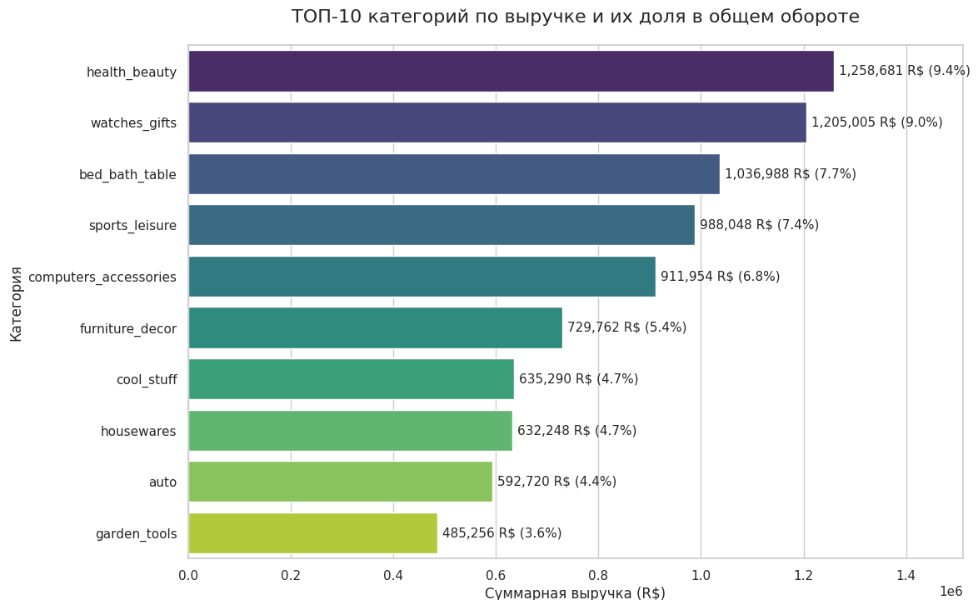
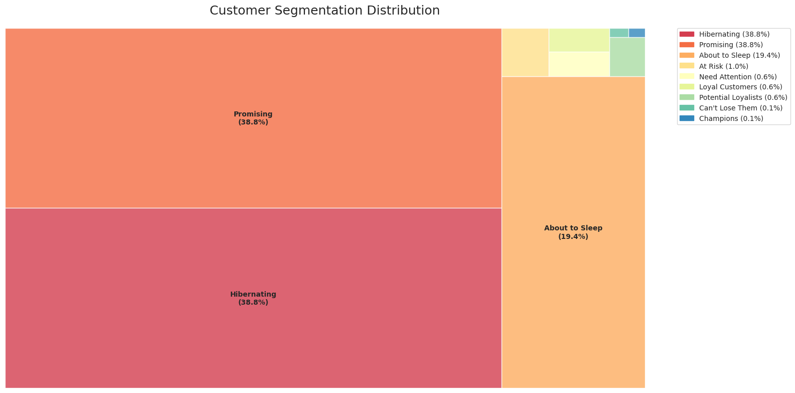
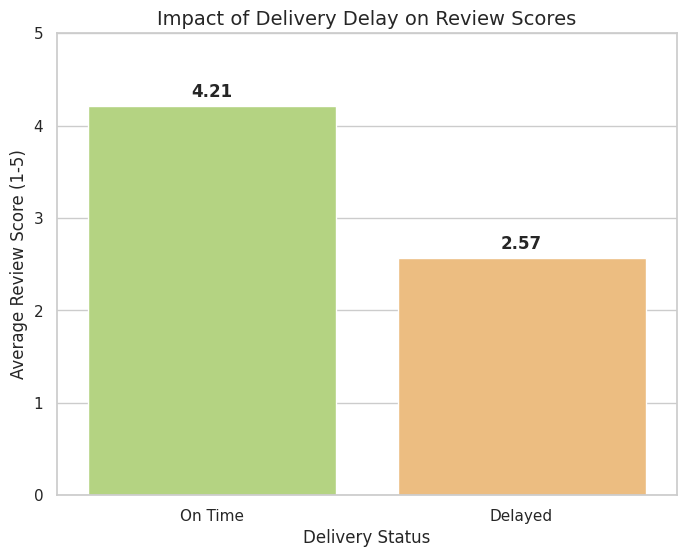

# E-commerce Analytics — Olist (Brazilian E-Commerce)
**Portfolio project (Junior Data Analyst / Analyst Intern)**  
**Stack:** Python (pandas, numpy), Jupyter / Google Colab, data visualization  
**Dataset:** Brazilian E-Commerce Public Dataset by Olist (Kaggle)

---

## RU кратко
Этот проект показывает end-to-end аналитический подход на данных e-commerce:  
- **Retention (когортный анализ)** — насколько хорошо платформа удерживает клиентов  
- **RFM сегментация** — какие типы клиентов преобладают и где точка роста  
- **Категории** — что покупают чаще всего  
- **Логистика и отзывы** — как задержки доставки связаны с удовлетворенностью

---

## 1) Business Goal
Understand customer behavior and operational factors that influence marketplace performance using Olist e-commerce data.

This project focuses on questions that are common for marketplaces and product teams:
- Are customers returning after their first purchase?
- What customer segments exist (loyal vs one-time)?
- Which product categories drive the most activity?
- Does delivery delay negatively affect customer experience?

---

## 2) What was done (Scope)
- Data preparation (loading, cleaning, merging the necessary tables for analysis)
- **Cohort-based retention analysis** (retention matrix / heatmap)
- **RFM segmentation** (Recency, Frequency, Monetary-style distribution analysis)
- Category-level analysis (Top categories)
- Delivery delay impact analysis (delivery performance vs customer satisfaction)

---

## 3) Key Outputs (Visual Highlights)

### 3.1 Customer Retention (Cohort Heatmap)

**How to read it:** each cohort groups customers by their first purchase period, and the cells show whether customers return in subsequent periods.  
**Why it matters:** retention is a core product metric for marketplaces; strong retention usually means good customer experience and repeat value.  
**What this helps decide:** whether the business should focus more on acquisition vs retention improvements (CRM, loyalty, remarketing).

---

### 3.2 Top Product Categories

**What it shows:** which categories dominate customer demand (by the measure used in the chart).  
**Why it matters:** category concentration impacts assortment strategy and marketing focus.  
**What this helps decide:** where to concentrate merchandising/marketing effort and which categories require deeper investigation.

---

### 3.3 RFM Distribution (Customer Segmentation)

**What it shows:** distribution of customers across recency/frequency/value-style dimensions (RFM-based view).  
**Why it matters:** RFM is a practical framework used in CRM and marketing to separate:
- customers who buy often / recently,
- customers who bought once and disappeared,
- potentially valuable segments for retention campaigns.

**What this helps decide:** which segments should receive retention offers, win-back campaigns, or loyalty mechanics.

---

### 3.4 Impact of Delivery Delay on Customer Experience

**What it shows:** relationship between delivery delays and customer outcomes (e.g., review score / satisfaction measure).  
**Why it matters:** logistics quality is one of the strongest drivers of marketplace satisfaction and repeat behavior.  
**What this helps decide:** whether improving delivery SLA in problematic cases/areas could increase customer satisfaction and reduce negative feedback.

---

## 4) Practical Business Takeaways (from the analyses above)
These are the types of conclusions this project enables (without inventing numbers):
- **Retention view** helps identify whether repeat purchasing is a weakness and whether cohorts behave consistently over time.
- **RFM view** supports actionable customer segmentation for CRM: retain loyal customers and re-activate inactive ones.
- **Category view** clarifies where demand is concentrated and which categories drive most of the activity.
- **Delivery delay impact** highlights logistics as a potential lever to improve customer satisfaction.

---

## 5) Data Access
The dataset is downloaded programmatically via the Kaggle API directly in the notebook
to ensure reproducibility and avoid manual file handling.

---

## 6) Limitations
- This is a public dataset; some business signals may be missing compared to real company data (marketing costs, full unit economics, full customer profile).
- Relationships shown in charts describe patterns in the data; they do not automatically prove causality.

---

## 7) Author
**Asandiyar Zhunusbek** — Junior Data Analyst(Kazakhstan)  
GitHub: https://github.com/AsyncHuman

